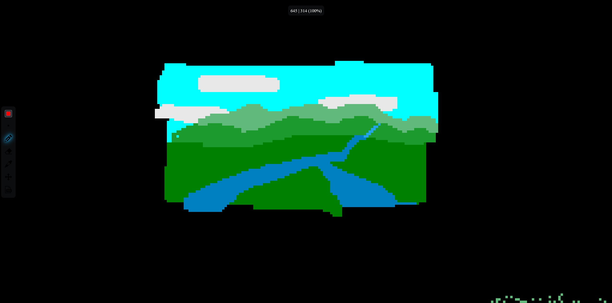

# Digital Garden Canvas
A server for a persistent pixel canvas to add to your own digital garden written in Python and Vanilla JavaScript.

# Concept
This software is supposed to run on a dedicated server to serve a pixel canvas on a network. The canvas is persistent, so it is never automatically reset, and multiple users can simultaneously edit it on different devices over the network. The canvas can be used on PC with a mouse or on phone/tablet with a touch screen.

On top is a navigation label showing the position of the top left camera corner and the zoom factor.

# Controls
- Tools (from top to bottom)
  - Color picker: Allows to pick any color
  - Size picker: Rotates the size of the brush to draw with
  - Eraser: Draws with black to "erase" elements
  - Color duplicator: Duplicates the selected color on the canvas
  - Move tool: Moves the canvas around and allows for zoom in touch mode
  - Download png: Downloads the full image as a png image

- Shortcuts and Touchscreen
  - Mouse wheel: Zooms the canvas
  - Mouse wheel pressed: Moves the canvas
  - ctr-s: Downloads the full image as a png image
  - To zoom with a touch screen select the move tool and performa a zoom motion with two fingers

# Storage
All storage happens in files. No database is required.
The image is stored in 3 phases:

1. Locally on the client machine is a copy of the canvas which is regularly synced with the remote image, and which requests updates on the remote image.
2. The remote image is in RAM of the server machine and is regularly saved to a file on the drive.
3. The stored file is regularly backed up to a backup file and archived. 

# Deployment
Use the docker-compose file in the docker directory (TBD).